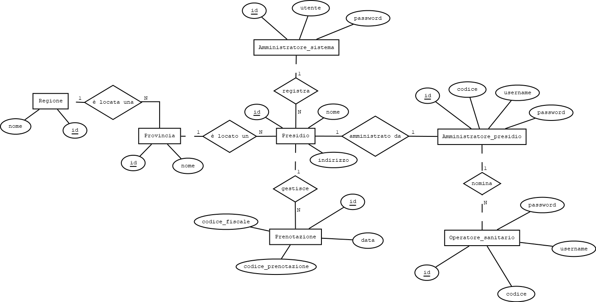

#  Portale per la prenotazione dei tamponi

Durante l'epidemia di COVID, una delle esigenze è stata quella di gestire la prenotazione dei tamponi.
Partendo da questo spunto, verrà qui sviluppata un'applicazione che risolva questo problema.

## Attori
- Amministratore del sistema;
- Amministratore del presidio;
- Operatore sanitario;
- Paziente.

## User stories
- ### Amministratore del sistema
    - voglio poter registrare dei presidi nei quali poter effettuare dei tamponi;
    - voglio poter creare delle credenziali da amministratore di un presidio.

- ### Amministratore del presidio
    - voglio poter gestire il mio presidio;
    - voglio poter creare delle credenziali degli operatori sanitari.

- ### Operatore sanitario
    - voglio poter visualizzare i tamponi effettuati in una giornata;
    - voglio poter visualizzare i tamponi prenotati;
    - voglio poter eseguire un tampone.

- ### Utente
    - voglio poter prenotare un tampone;
    - voglio poter scegliere dove e quando effettuare un tampone;
    - voglio poter visualizzare i dati di una mia prenotazione;
    - voglio poter visualizzare l'esito del mio tampone;
    - voglio poter annullare una prenotazione;
    - voglio poter essere avvisato dell'avvicinarsi della data dell'appuntamento.
  
## Diagramma Entità/Relazioni
